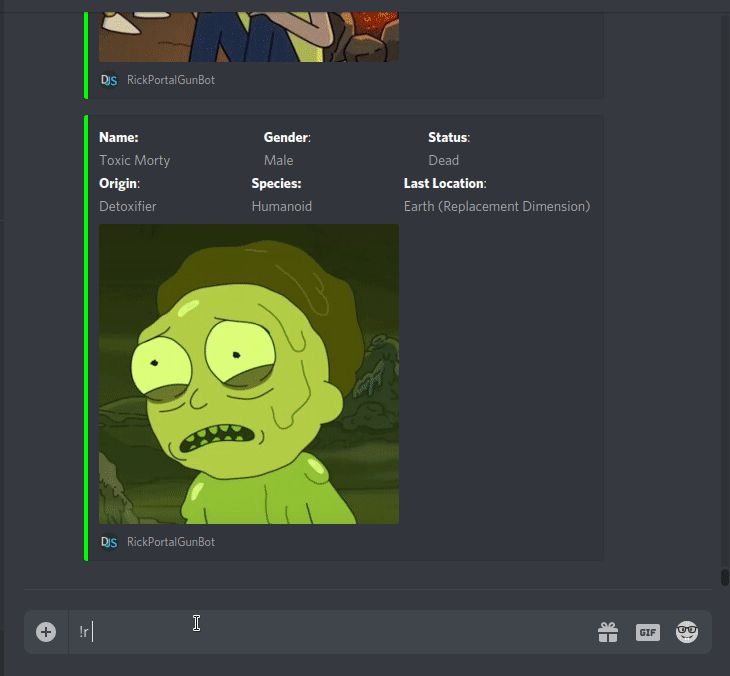

# rick-portal-gun-bot  
Just a discord bot which consumes [The Rick And Morty API](https://rickandmortyapi.com/) to serve the characters info.

## Commands  
```!r [character name] [dead|unknown|alive]```

## Examples


## How to run
1. You will need to create an Discord app (https://discordapp.com/developers/applications/)
2. After you've created an new Discord aplication, get the bot token (on Bot section)
3. Create a file called .env in the root of the project and put the value ```DISCORD_API_KEY = YOUR_BOT_API_KEY```
4. Add the bot to your server, to create a link to invite your bot to your server go to https://discordapi.com/permissions.html
4. ```cd path/to/rick-portal-gun-bot```
5. ```npm install```
6. ```npm run dev```
7. On your server ```!r [character name] [dead|alive|unknown]```